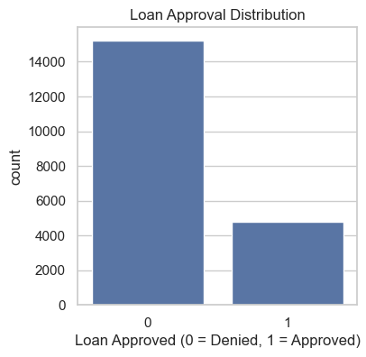
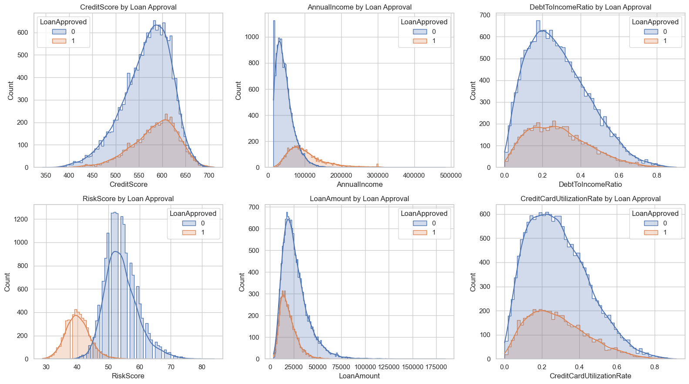
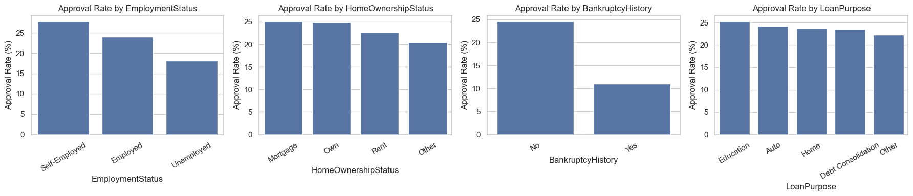
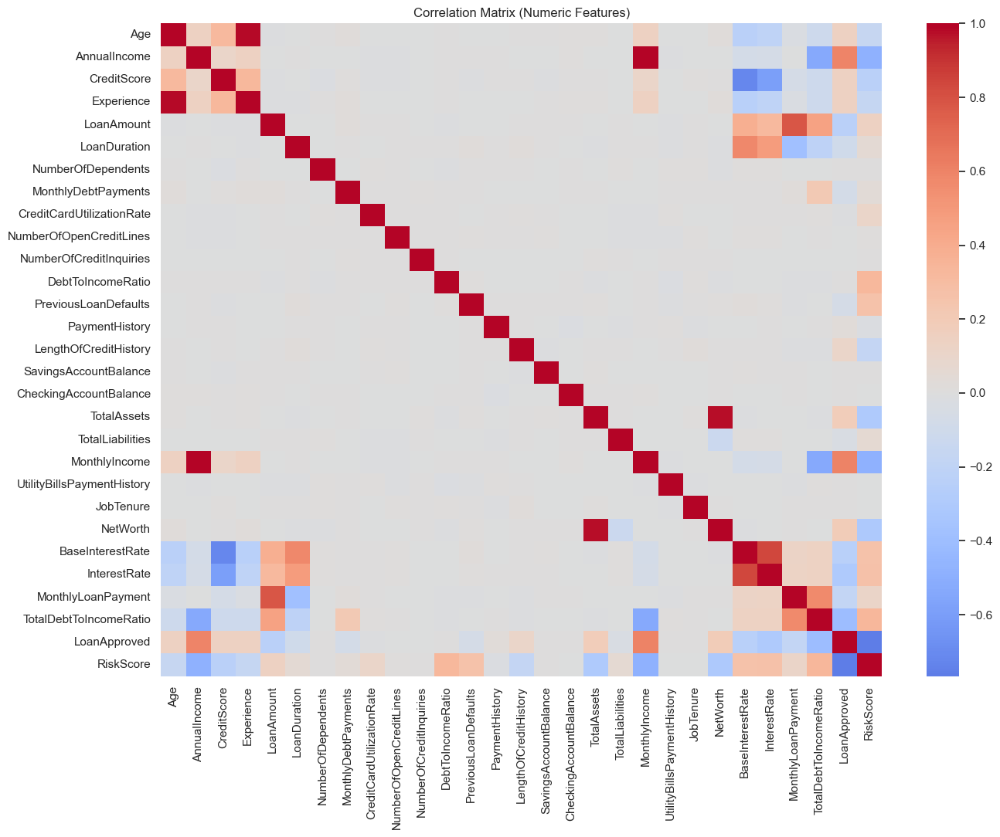
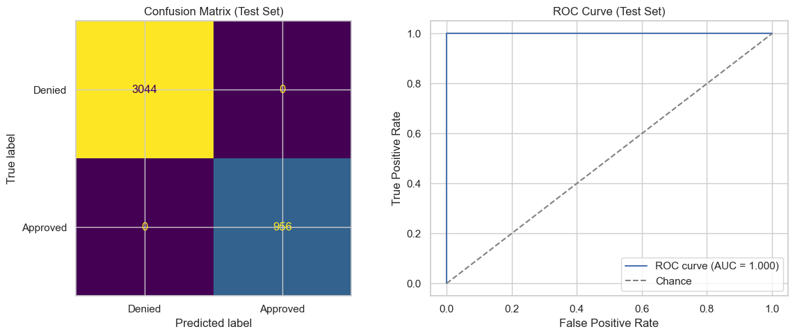
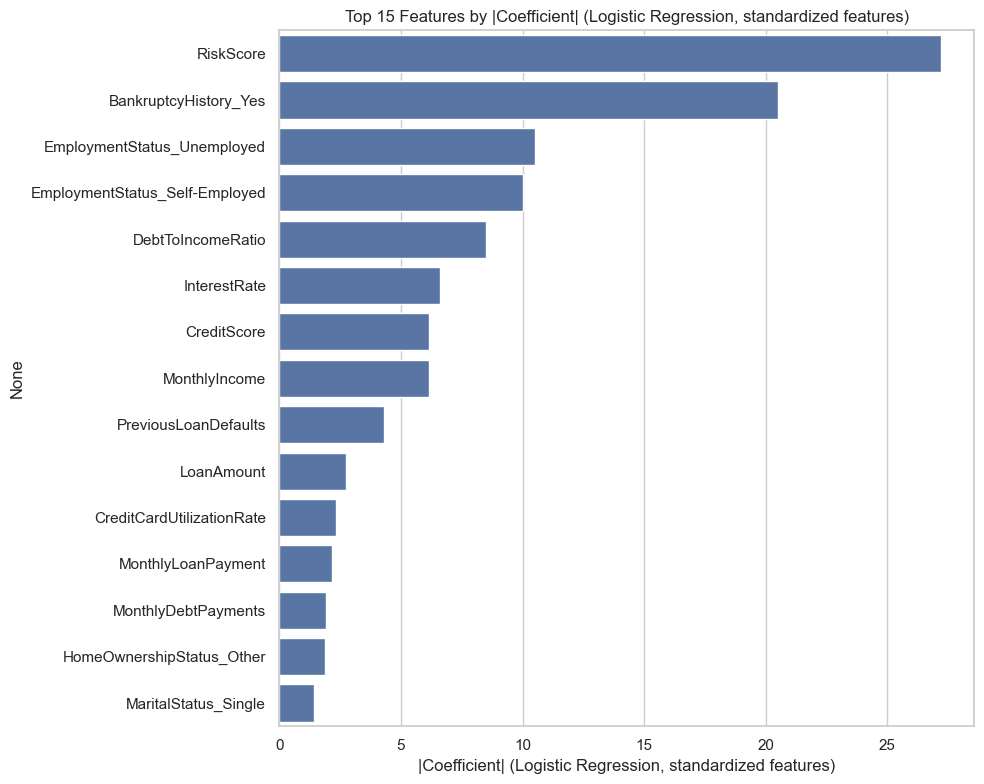
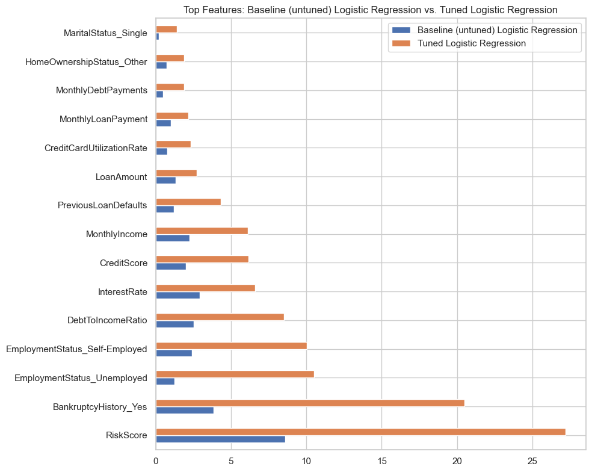

# FinTech Innovations: Predicting Loan Approval Decisions

A binary classification project that predicts whether a loan application will be approved or
denied, built as the capstone ("Summative") project for a Machine Learning course. Full technical
work — EDA, preprocessing pipeline, modeling, tuning, evaluation — lives in
[`financial_loan_risk.ipynb`](financial_loan_risk.ipynb); this README summarizes the project so you
don't need to open the notebook to see what it does or how it performed.

## Bottom line up front

A tuned, regularized **Logistic Regression** model — built on a preprocessing pipeline that
imputes, scales, and encodes numeric, nominal, and ordinal applicant features — predicts FinTech
Innovations' historical loan approval decisions almost perfectly (ROC-AUC 1.000, recall 1.000 on
the held-out test set), and consistently outperforms a Random Forest alternative on both
discrimination and estimated business cost. Its strongest coefficients point to the applicant's
internal risk score, income, total debt-to-income ratio, and loan interest rate — standard,
explainable underwriting signals.

Near-perfect accuracy on a decision this nuanced is itself worth flagging rather than just
celebrating: it strongly suggests the historical `LoanApproved` labels were generated by a fairly
deterministic rule or formula over these same applicant features (common in synthetic/teaching
datasets), rather than noisy, judgment-based human decisions. The model should be understood as
**learning to reproduce that rule**, not as a validated predictor of real-world default risk — see
[Limitations](#limitations) below.

## The business problem

FinTech Innovations currently relies on loan officers manually reviewing applicant information
(income, credit history, debts, assets, and an internal `RiskScore`) to approve or deny loans.
Manual review is slow, expensive, and inconsistent — different officers can reach different
conclusions from the same information, creating fairness and compliance risk.

**Error costs are asymmetric**, which shapes the whole modeling approach:

| Error type | What happens | Cost |
|---|---|---|
| False Positive | Approve someone who should be denied | ~$2,000 (expected loss from a bad loan) |
| False Negative | Deny someone who should be approved | ~$500 (lost interest income / relationship) |

Because a bad loan is roughly 4x more expensive than a missed good customer, the project optimizes
for more than raw accuracy: **ROC-AUC**, **recall/precision on the approved class**, and a **custom
business-cost metric** that converts the confusion matrix directly into estimated dollars.

## The data

| | |
|---|---|
| Rows | 20,000 loan applications |
| Columns | 35 (raw), spanning numeric, nominal categorical, and ordinal features |
| Target | `LoanApproved` (0 = Denied, 1 = Approved) |
| Class balance | 76.1% Denied / 23.9% Approved |
| Missing data | `EducationLevel` (901), `MaritalStatus` (1,331), `SavingsAccountBalance` (572) |

The target is imbalanced enough that a model that always predicts "deny" would already look ~76%
"accurate" while being useless — one of the reasons accuracy alone is not used to judge the model.



### What the data shows



`RiskScore` shows by far the strongest separation between approved and denied applicants — which
makes sense, since it's FinTech's own internal risk score and is very likely already an input to
the current manual decision. `CreditScore`, `DebtToIncomeRatio`, and payment-history features also
separate the two classes clearly, matching standard underwriting intuition.



`BankruptcyHistory` and `EmploymentStatus` show large swings in approval rate across categories,
confirming they carry real signal despite being categorical rather than numeric.



## Approach

1. **Preprocessing pipeline** (`ColumnTransformer` + `Pipeline`, fit only on training data to avoid
   leakage):
   - Numeric features → median/mean imputation + standard scaling
   - Nominal categoricals (`EmploymentStatus`, `MaritalStatus`, `HomeOwnershipStatus`,
     `BankruptcyHistory`, `LoanPurpose`) → most-frequent imputation + one-hot encoding
   - Ordinal feature (`EducationLevel`) → most-frequent imputation + ordinal encoding, preserving
     High School < Associate < Bachelor < Master < Doctorate
2. **Model comparison** — Logistic Regression vs. Random Forest, both with `class_weight='balanced'`
   to account for the imbalanced target, compared via 5-fold cross-validation on ROC-AUC, recall,
   precision, and the custom business-cost score.
3. **Hyperparameter tuning** — a broad `RandomizedSearchCV` (25 iterations) followed by a focused
   `GridSearchCV` around the best region, refit on ROC-AUC.
4. **Evaluation** — final model scored once on a held-out test set, plus a subgroup breakdown by
   `EmploymentStatus` and `HomeOwnershipStatus` as a lightweight fairness/robustness check.

## Model comparison (cross-validated)

| Model | ROC-AUC | Recall | Precision | Business cost (avg. per fold) |
|---|---|---|---|---|
| **Logistic Regression** | **1.000** | **1.000** | 0.997 | **$4,100** |
| Random Forest | 0.999 | 0.984 | 0.972 | $49,400 |

Logistic Regression won on every metric, including estimated business cost, and was carried
forward into tuning. The tuned model settled on strong L1 regularization
(`C ≈ 32.5`, `penalty='l1'`, `solver='liblinear'`, `class_weight='balanced'`).

## Final model performance (held-out test set)



| Metric | Test-set value |
|---|---|
| ROC-AUC | 1.000 |
| Recall (Approved) | 1.000 |
| Precision (Approved) | 1.000 |
| Estimated business cost | $0 |

**Subgroup check:** recall and precision are both 1.000 across every `EmploymentStatus` (Employed,
Self-Employed, Unemployed) and `HomeOwnershipStatus` (Mortgage, Own, Rent, Other) segment — no
subgroup shows degraded performance in this dataset.

## What drives the model



| Rank | Feature | \|Coefficient\| |
|---|---|---|
| 1 | `RiskScore` | 27.20 |
| 2 | `BankruptcyHistory_Yes` | 20.49 |
| 3 | `EmploymentStatus_Unemployed` | 10.51 |
| 4 | `EmploymentStatus_Self-Employed` | 10.03 |
| 5 | `DebtToIncomeRatio` | 8.50 |
| 6 | `InterestRate` | 6.60 |
| 7 | `CreditScore` | 6.16 |
| 8 | `MonthlyIncome` | 6.14 |

`RiskScore`, income, debt-to-income ratio, and interest rate dominate — consistent with both the
EDA correlations and standard lending intuition. Because `RiskScore` is FinTech's own internal
score (and likely already informs the current manual process), the model is, in large part,
learning to **reproduce FinTech's existing scoring logic** rather than discovering new risk signal
— see [Limitations](#limitations).

As a follow-up check, the tuned model's feature importances were compared against an untuned
baseline (same model family, default hyperparameters) to see how the search actually shifted the
model's reliance on different features:



## Business recommendations

1. **Deploy as decision support, not full automation.** Auto-approve/auto-deny high-confidence
   cases and route borderline-probability applicants to human underwriters.
2. **Monitor subgroup performance in production**, re-running the recall/precision-by-segment check
   regularly on live data (and extending it to any legally protected attributes available to
   compliance).
3. **Set the decision threshold using the business-cost metric**, not a default 0.5 cutoff, since
   false positives and false negatives cost FinTech different amounts.
4. **Revisit the `RiskScore` dependency** if the goal shifts from "replicate current decisions
   faster" to "improve risk assessment itself" — that calls for a model trained without `RiskScore`
   and validated against actual loan-performance/default outcomes.

## Limitations

- The target (`LoanApproved`) reflects **historical approval decisions**, not verified loan
  *outcomes* (e.g., whether the loan was actually repaid). A model trained this way learns to
  reproduce past decisions — including any biases baked into the historical process — rather than
  learning true creditworthiness.
- The custom business-cost metric uses illustrative cost assumptions ($2,000 per bad loan approved,
  $500 per good applicant missed); real, portfolio-specific cost figures would refine both the
  metric and the eventual decision threshold.
- Tuning used a fixed 25-iteration random search plus one focused grid search for time efficiency;
  a larger compute budget could search a wider hyperparameter space or additional model families.
- Given `RiskScore`'s likely circularity with the current decision process, a follow-up experiment
  comparing model performance with and without `RiskScore` would clarify how much independent lift
  the other applicant features provide on their own.

## Repo contents

| File | Description |
|---|---|
| [`financial_loan_risk.ipynb`](financial_loan_risk.ipynb) | Full analysis: EDA, preprocessing pipeline, modeling, tuning, evaluation |
| [`financial_loan_data.csv`](financial_loan_data.csv) | Source dataset (20,000 applications, 35 raw features) |
| `images/` | Charts extracted from the notebook, used in this README |

### Reproducing the results

```bash
pip install numpy pandas matplotlib seaborn scikit-learn
jupyter nbconvert --to notebook --execute --inplace financial_loan_risk.ipynb
```
